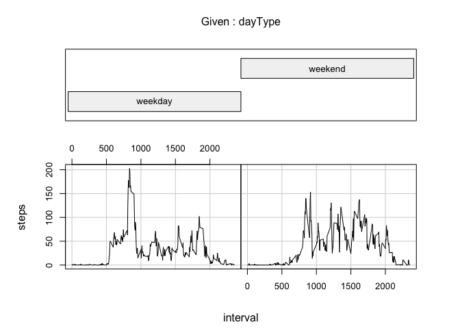

### Loading and preprocessing the data

> Show any code that is needed to  
> Load the data (i.e. read.csv())  
> Process/transform the data (if necessary) into a format suitable for
> your analysis

    # does the csv file already exist?
    if (!file.exists("activity.csv"))
      {
        ##  get it
        cat ("downloading the zip file\n")
        system ("curl --get https://d396qusza40orc.cloudfront.net/repdata%2Fdata%2Factivity.zip >data.zip")
        
        ## unzip it
        cat ("unzipping the zip file\n")
        system ("unzip -q data.zip")
      }

    # read the data
    activity = read.csv ("activity.csv")

    # examine some information about the data
    str (activity)

    ## 'data.frame':    17568 obs. of  3 variables:
    ##  $ steps   : int  NA NA NA NA NA NA NA NA NA NA ...
    ##  $ date    : Factor w/ 61 levels "2012-10-01","2012-10-02",..: 1 1 1 1 1 1 1 1 1 1 ...
    ##  $ interval: int  0 5 10 15 20 25 30 35 40 45 ...

    summary (activity)

    ##      steps                date          interval     
    ##  Min.   :  0.00   2012-10-01:  288   Min.   :   0.0  
    ##  1st Qu.:  0.00   2012-10-02:  288   1st Qu.: 588.8  
    ##  Median :  0.00   2012-10-03:  288   Median :1177.5  
    ##  Mean   : 37.38   2012-10-04:  288   Mean   :1177.5  
    ##  3rd Qu.: 12.00   2012-10-05:  288   3rd Qu.:1766.2  
    ##  Max.   :806.00   2012-10-06:  288   Max.   :2355.0  
    ##  NA's   :2304     (Other)   :15840

    sum (activity$steps, na.rm=TRUE)

    ## [1] 570608

We can already see that:

-   There are 17568 observations
-   Number of steps per interval range from 0 to 806 with 2,304 missing
    (NA) values
-   There are observations from 61 different dates ranging from 10/1/12
    to 11/30/12 - all of October and November 2012
-   Interval ranges from 0 to 2355 suggesting it represents hours and
    minutes of each 5-minute interval
-   Total number of steps measured is 570,608

We observe that date is already a factor. At this point, little value is
seen in converting steps or interval into a factor. So no further
processing is needed at this point.

### What is mean total number of steps taken per day?

> For this part of the assignment, you can ignore the missing values in
> the dataset.  
> Make a histogram of the total number of steps taken each day  
> Calculate and report the mean and median total number of steps taken
> per day

    # sum steps for each date
    a = aggregate (steps ~ date, data=activity, FUN=sum)

    # exploratory
    str (a)

    ## 'data.frame':    53 obs. of  2 variables:
    ##  $ date : Factor w/ 61 levels "2012-10-01","2012-10-02",..: 2 3 4 5 6 7 9 10 11 12 ...
    ##  $ steps: int  126 11352 12116 13294 15420 11015 12811 9900 10304 17382 ...

    plot (a$date, a$steps)

    boxplot (a$steps)

    sum (a$steps)

    ## [1] 570608

    # plot histogram
    hist (a$steps, labels=TRUE)

    # shows both mean and median
    summary (a)

    ##          date        steps      
    ##  2012-10-02: 1   Min.   :   41  
    ##  2012-10-03: 1   1st Qu.: 8841  
    ##  2012-10-04: 1   Median :10765  
    ##  2012-10-05: 1   Mean   :10766  
    ##  2012-10-06: 1   3rd Qu.:13294  
    ##  2012-10-07: 1   Max.   :21194  
    ##  (Other)   :47

### What is the average daily activity pattern?

> Make a time series plot (i.e. type = "l") of the 5-minute interval
> (x-axis) and the average number of steps taken, averaged across all
> days (y-axis)  
> Which 5-minute interval, on average across all the days in the
> dataset, contains the maximum number of steps?

    # take the mean steps for each interval
    b = aggregate (steps ~ interval, data = activity, mean)

    # plot but supress the x-axis
    plot (b, type = "l", xaxt = "n")

    # draw x-axis with tick marks every 3 hours
    axis (1, at = seq (0, 2400, 300))

    maxIntervalIndex = which.max (b$steps)
    maxInterval = b$interval [maxIntervalIndex]
    maxInterval

    ## [1] 835

    maxSteps = b$steps [maxIntervalIndex]
    maxSteps

    ## [1] 206.1698

The interval with highest average steps across all dates is 835 or 8:35
AM. The average steps in that interval is 206.1698.

### Imputing missing values

> Note that there are a number of days/intervals where there are missing
> values (coded as NA). The presence of missing days may introduce bias
> into some calculations or summaries of the data.  
> Calculate and report the total number of missing values in the dataset
> (i.e. the total number of rows with NAs)  
> Devise a strategy for filling in all of the missing values in the
> dataset. The strategy does not need to be sophisticated. For example,
> you could use the mean/median for that day, or the mean for that
> 5-minute interval, etc.  
> Create a new dataset that is equal to the original dataset but with
> the missing data filled in.  
> Make a histogram of the total number of steps taken each day and
> Calculate and report the mean and median total number of steps taken
> per day. Do these values differ from the estimates from the first part
> of the assignment? What is the impact of imputing missing data on the
> estimates of the total daily number of steps?

    # total number of NAs
    sum (is.na (activity))

    ## [1] 2304

The total number of NAs in the activity dataset is 2304. They all appear
in the steps column. This is also confirmed in the earlier output from
summary (a).

My strategy for filling in the missing values of the data set (steps) is
as follows:

-   if a value is NA, use the previous value
-   in case this is the first row of the dataset, simply use zero

I have used this method over the years in Excel to deal with missing
values, and it has generally proven successful. It tends to "smooth out"
the data.

    d = activity$steps
    l = length (d)
    l

    ## [1] 17568

    for (i in 1:l)
      {
      #cat (d[i], "\n")
      
      if (is.na (d[i]))
        {
        if (i == 1)
          {
          d [i] = 0
          #cat (i, "replaced with zero\n")
          }
        else
          {
          d [i] = d [i-1]
          #cat (i, "replaced with ", d [i-1], "\n")
          }
        }
      }

    # d no longer has any NA values
    sum (is.na (d))

    ## [1] 0

    str (d)

    ##  num [1:17568] 0 0 0 0 0 0 0 0 0 0 ...

    summary (d)

    ##    Min. 1st Qu.  Median    Mean 3rd Qu.    Max. 
    ##    0.00    0.00    0.00   32.48    0.00  806.00

    # construct a new copy of activities
    c = activity

    # replace steps with the imputed values
    c$steps = d

    # sum steps for each date
    e = aggregate (steps ~ date, data = c, sum)

    # exploratory
    str (e)

    ## 'data.frame':    61 obs. of  2 variables:
    ##  $ date : Factor w/ 61 levels "2012-10-01","2012-10-02",..: 1 2 3 4 5 6 7 8 9 10 ...
    ##  $ steps: num  0 126 11352 12116 13294 ...

    plot (e$date, e$steps)

    boxplot (e$steps)

    sum (e$steps)

    ## [1] 570608

    e

    ##          date steps
    ## 1  2012-10-01     0
    ## 2  2012-10-02   126
    ## 3  2012-10-03 11352
    ## 4  2012-10-04 12116
    ## 5  2012-10-05 13294
    ## 6  2012-10-06 15420
    ## 7  2012-10-07 11015
    ## 8  2012-10-08     0
    ## 9  2012-10-09 12811
    ## 10 2012-10-10  9900
    ## 11 2012-10-11 10304
    ## 12 2012-10-12 17382
    ## 13 2012-10-13 12426
    ## 14 2012-10-14 15098
    ## 15 2012-10-15 10139
    ## 16 2012-10-16 15084
    ## 17 2012-10-17 13452
    ## 18 2012-10-18 10056
    ## 19 2012-10-19 11829
    ## 20 2012-10-20 10395
    ## 21 2012-10-21  8821
    ## 22 2012-10-22 13460
    ## 23 2012-10-23  8918
    ## 24 2012-10-24  8355
    ## 25 2012-10-25  2492
    ## 26 2012-10-26  6778
    ## 27 2012-10-27 10119
    ## 28 2012-10-28 11458
    ## 29 2012-10-29  5018
    ## 30 2012-10-30  9819
    ## 31 2012-10-31 15414
    ## 32 2012-11-01     0
    ## 33 2012-11-02 10600
    ## 34 2012-11-03 10571
    ## 35 2012-11-04     0
    ## 36 2012-11-05 10439
    ## 37 2012-11-06  8334
    ## 38 2012-11-07 12883
    ## 39 2012-11-08  3219
    ## 40 2012-11-09     0
    ## 41 2012-11-10     0
    ## 42 2012-11-11 12608
    ## 43 2012-11-12 10765
    ## 44 2012-11-13  7336
    ## 45 2012-11-14     0
    ## 46 2012-11-15    41
    ## 47 2012-11-16  5441
    ## 48 2012-11-17 14339
    ## 49 2012-11-18 15110
    ## 50 2012-11-19  8841
    ## 51 2012-11-20  4472
    ## 52 2012-11-21 12787
    ## 53 2012-11-22 20427
    ## 54 2012-11-23 21194
    ## 55 2012-11-24 14478
    ## 56 2012-11-25 11834
    ## 57 2012-11-26 11162
    ## 58 2012-11-27 13646
    ## 59 2012-11-28 10183
    ## 60 2012-11-29  7047
    ## 61 2012-11-30     0

    # plot histogram
    hist (e$steps, labels=TRUE)

    # shows both mean and median
    summary (e)

    ##          date        steps      
    ##  2012-10-01: 1   Min.   :    0  
    ##  2012-10-02: 1   1st Qu.: 6778  
    ##  2012-10-03: 1   Median :10395  
    ##  2012-10-04: 1   Mean   : 9354  
    ##  2012-10-05: 1   3rd Qu.:12811  
    ##  2012-10-06: 1   Max.   :21194  
    ##  (Other)   :55

    # difference between original and new estimate with imputed values
    summary (a$steps)

    ##    Min. 1st Qu.  Median    Mean 3rd Qu.    Max. 
    ##      41    8841   10760   10770   13290   21190

    summary (e$steps)

    ##    Min. 1st Qu.  Median    Mean 3rd Qu.    Max. 
    ##       0    6778   10400    9354   12810   21190

    summary (a$steps) - summary (e$steps)

    ##    Min. 1st Qu.  Median    Mean 3rd Qu.    Max. 
    ##      41    2063     360    1416     480       0

As it turns out, every NA value is preceded by another NA or a zero. So
in effect all imputed values are zero. Which does not change the total
number of steps or the daily totals. In the histogram, only the first
bar is higher due to the newly added zero values. But this also skews
both the mean and the median as indicated in the new summary.

    # number of zeroes in the original data set
    t1 = table (activity$steps)
    t1 ["0"]

    ##     0 
    ## 11014

    # number of zeroes in the modified data set
    t2 = table (d)
    t2 ["0"]

    ##     0 
    ## 13318

    # should match the number of NAs in the original set
    t2 ["0"] - t1 ["0"]

    ##    0 
    ## 2304

### Are there differences in activity patterns between weekdays and weekends?

> For this part the weekdays() function may be of some help here. Use
> the dataset with the filled-in missing values for this part.  
> Create a new factor variable in the dataset with two levels --
> "weekday" and "weekend" indicating whether a given date is a weekday
> or weekend day.  
> Make a panel plot containing a time series plot (i.e. type = "l") of
> the 5-minute interval (x-axis) and the average number of steps taken,
> averaged across all weekday days or weekend days (y-axis).

    # c is the modified version of activity
    c$date = as.Date (c$date)
    c$dayOfWeek = weekdays (c$date)

    # depending on value of dayOfWeek, set dayType
    c$dayType <- as.factor (ifelse (c$dayOfWeek %in% c ("Saturday","Sunday"), "weekend", "weekday")) 

    d = aggregate (steps ~ interval + dayType, data = c, mean)

    coplot (steps ~ interval | dayType, data = d, type = "l")

Yes - there is a difference in activity pattern. During the week there
is a peak in the early morning, followed by generally lower numbers of
steps. Yet with defined peaks around lunchtime and later in the day,
perhaps corresponding to leaving work. Whereas on the weekends, there
appears to be a generally higher level of activity through out the day
with few distinguishing peaks. As well there seems to be more late night
activity on the weekends.
